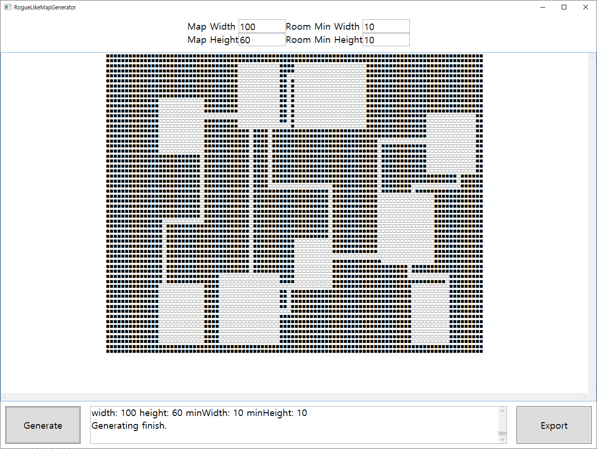

# Rogue-Like-Map-Generator
로그라이크 게임 맵 생성기 입니다.  
로그라이크 게임을 제작할 때 활용해보기 위해 만들었습니다.

## Keywords
WPF, MVVM, BSP (Binary Space Partitioning)  

## 스크린샷  
 

## 사용 방법
1. 원하는 맵 크기 및 최소 방 크기를 정합니다.
2. Generate 버튼을 누르면 잠시 로딩 후 맵이 생성됩니다.
3. Export 버튼을 눌러서 txt 파일로 저장할 수 있습니다.
    - RogueLikeMap.txt 로 실행 파일과 같은 경로에 저장됩니다.

## 추가 정보
1. 모든 방이 연결 되어있음은 보장됩니다. 
2. 맵 크기와 최소 방 크기의 차이가 충분해야 맵이 보기 좋게 그려집니다.

## 원리
- BSP Tree를 사용했습니다.
- 방은 가로크기가 길면 세로로, 세로크기가 길면 가로로 나뉘어집니다.
- 나뉘어 지는 기준은 길이의 25%~75% 지점 중 랜덤으로 정해집니다.
- 최소 방 크기보다 작게 나뉘어지는 경우는 방을 생성하지 않습니다.
- 방이 모두 만든 이후, 방 연결 작업을 시작합니다.
- 방 연결 작업은 BSP Tree에서 각 노드의 자식 노드들을 합치면서 진행합니다.
- 방 연결 작업에서 자식 방이 많을 경우 어떤 방이 통로 역할을 할지는 랜덤입니다.